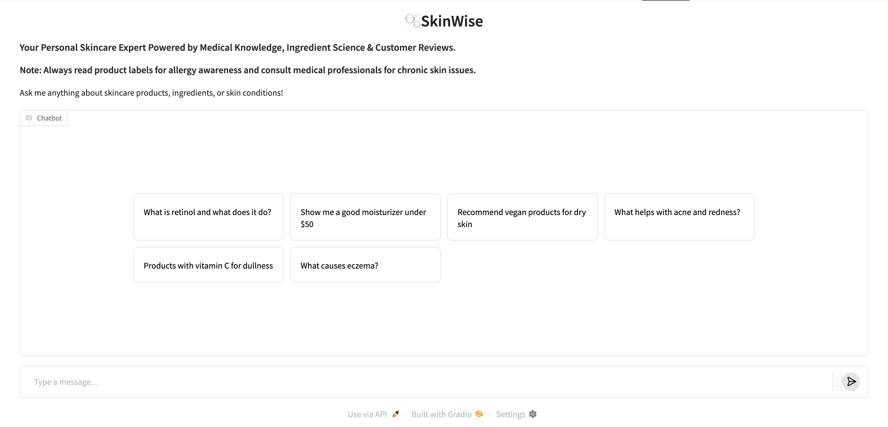
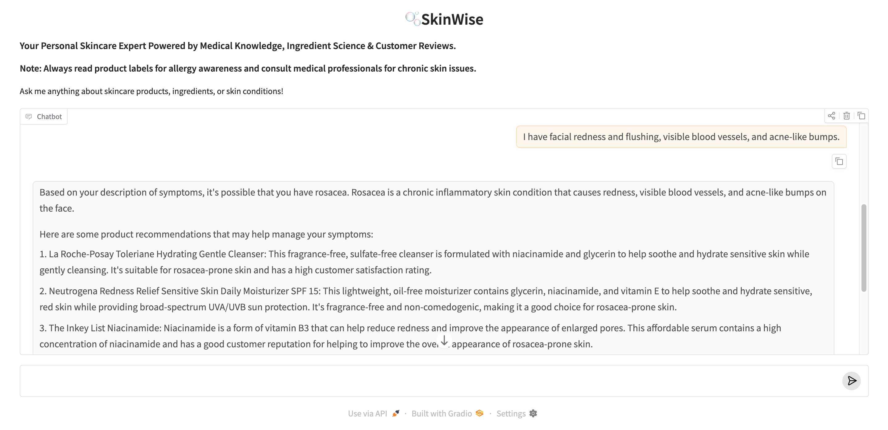

# 🫧SkinWise
### Contributors: 🧼[Gabriella Chu](https://github.com/gaby-chu), 🛍️[Yelene Cisse](https://github.com/ymciss0), 🧬[Gabrielle Park](https://github.com/gabriellepark), 🧴[Kshamaa Suresh](https://github.com/KshamaaS)

## Overview:

SkinWise is an AI-powered skincare assistant that combines product metadata, reviews, and medical knowledge to deliver personalized recommendations to users.

*Home page for SkinWise where users can input skincare-related questions*

## Important Links:
- *Huggingface UI for real time execution*: https://huggingface.co/spaces/kshamaasuresh/skincare-agent 
- *Google Colab code file*: https://drive.google.com/file/d/1YAom8NM-w857kqB-SeNHPIwpFlLKxxj4/view?usp=sharing 
- *Google Drive Link for the video presentation, slide deck and colab code files with supporting documents*: https://drive.google.com/drive/folders/1da77WlskEXwA0Rgegt-ayM938ODsQnno?usp=sharing
- *Video Presentation*: https://drive.google.com/drive/folders/1p99c6gwCJzVLv41xK0c1kEPw9Kd0_vCb?usp=sharing

**Data Sources**:
- *Sephora Dataset*: https://www.kaggle.com/datasets/nadyinky/sephora-products-and-skincare-reviews 
- *Dermatology Dataset*: https://huggingface.co/datasets/Carxofa85/dermatology 
- *Skincare Ingredient Dataset*: https://www.kaggle.com/datasets/amaboh/skin-care-product-ingredients-inci-list 
 

## Motivation and Goal

The global beauty market is a multi-billion dollar industry, with skincare accounting for nearly half of total sales and continuing to grow every year. However, new products and trendy ingredients are constantly entering the market, making it increasingly difficult for consumers to know which products would best suit their individual needs. Whether someone is trying to address a specific skin concern, manage a condition like acne or eczema, or stay within a budget, navigating the skincare space can be overwhelming.

To address this challenge, we developed SkinWise. **Our goal is to bridge the gap between complex skincare information and user-friendly recommendations by allowing users to ask questions and receive custom, easy-to-understand responses.** SkinWise take skincare questions, symptoms, and product preferences and provide clear, personalized product recommendations. 

## Architecture

The SkinWise workflow brings together rich skincare product and medical data and a powerful AI agent to meet users' individual needs:

# Project Workflow

1. **Data Collection and Preparation**
   - **Dermatology Data:** Import raw data from sources (CSV, SQL, APIs).
   - **Skincare Ingredient Data:** Check schema consistency and data types.
   - **Sephora Data:** Snapshot data for reproducibility.

2. **Product Review Sentiment Analysis**
   - **Exploratory Data Analysis (EDA):** Visualize distributions and correlations.
   - **Data Cleaning:** Handle missing values, duplicates, and formatting errors.
   - **Feature Engineering:** Scale features, encode variables, and create new features.

3. **LLM Agent**
   - Embeddings and Vectorstore creation
   - LLM from Mistral
   - Skincare Agent Class Definition
   - Gradio UI implementation

4. **Model Evaluation**
   - **Intent Extraction Accuracy**
   - **Filter Accuracy**
   - **Response Time Performance**
   
5. **UI Interface**
   - Google Colab
   - HuggingFace UI
   - Gradio UI
   - Other test cases: Google Vertex AI, Google Cloud console

## Getting Started

[Ask SkinWise your skincare-related questions!](https://huggingface.co/spaces/kshamaasuresh/skincare-agent)

## Limitations and Future Directions

The project faced several key limitations during development and deployment. Significant computational resource constraints required experimentation with multiple platforms (Google Colab, HuggingFace Spaces, Google Vertex AI, Google Cloud Console) before achieving viable deployment, revealing practical tradeoffs between development flexibility and production scalability. Recommendation quality is constrained by the Sephora-focused catalog of 2,420 products. The AI agent cannot replace professional dermatological advice and lacks access to medical-level patient data that could enhance reasoning. Technical constraints include a 60-second timeout limiting query complexity, a text-only interface preventing visual skin analysis, and challenges parsing complex negations. Future iterations could address these through advanced architectures, comprehensive medical datasets, expanded product catalogs, and enhanced computational resources for public-scale deployment.

Going forward, there are several directions that we see this project developing. To make the model more robust to a wider range of user inputs, we would like to add more data to our model. Specifically, we aim to include product data from a wider range of companies; currently, our product data is limited to products sold at Sephora. Although Sephora is one of the largest makeup retailers and the current leader in luxury beauty products, to make our recommendation system more useful for a broader range of audiences, we aim to include product data from retailers such as Ulta or CVS. There are also many independent skin care retailers that do not sell their products in such stores. A longer term goal would be to add products from global markets that might not be sold on the U.S. version of the Sephora website to address an even wider range of audiences. Furthermore, in the future, we aim to improve the user experience by allowing users to upload images of their skin to the interface. By integrating a computer vision model that is able to recognize skin concerns from the uploaded images, we would be able to incorporate visual skin analysis into the recommendation pipeline. 

## Note
Project created for [COMS4995W032: Applied Machine Learning](https://columbia-coms4995.github.io/aml-fall2025/), taught by Dr. Spencer Luo.
